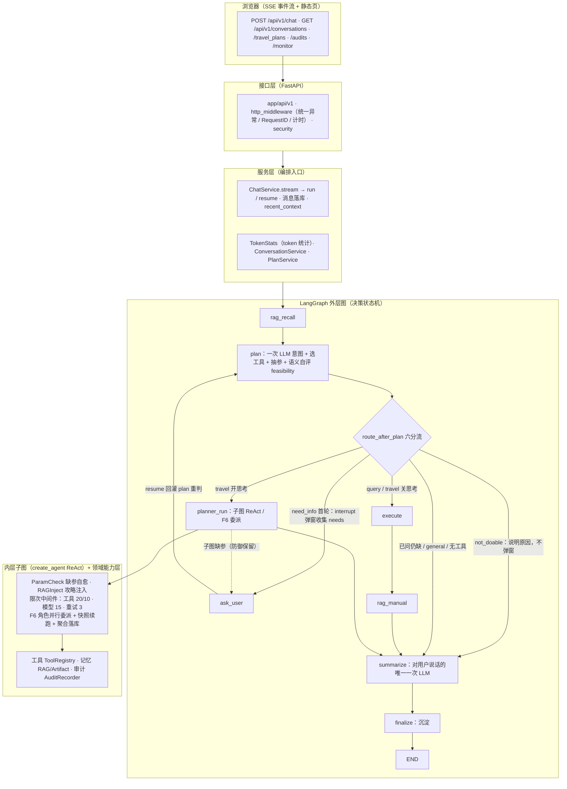
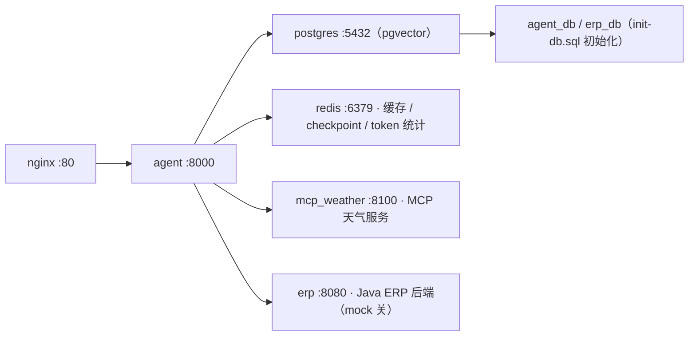

# travel_plan_agent — 智能旅游规划 Agent

基于 **FastAPI + LangGraph + LangChain** 的人机协同旅游规划 Agent。采用「分层单体 + Agent 编排」架构：外层 LangGraph 状态机负责决策与编排，内层 ReAct 子 Agent 负责复杂推演。支持 **Human-in-the-Loop 中断续跑**、**语义分级交互**（可行 / 需补充 / 不可完成自评）、双路记忆（RAG 历史会话 + 攻略知识）、多子 Agent 委派、上下文外部化与审计可观测。

---

## 一、总体架构



> Mermaid 版本可在 GitHub/GitLab/Gitee 直接渲染；本地可用 VS Code「Markdown Preview Mermaid Support」插件。
>
> 中断闭环：`interrupt()` 挂起 → `resume()` 从 checkpoint 续跑（同一 `conversation_id` / `thread_id`）。

**关键设计：**

- **外层状态机 + 内层 ReAct**：外层决策（分类 / 选参 / 语义自评 / 分流），内层执行（多步工具推理），两层解耦，checkpoint 相互隔离（子图独立 thread_id）。
- **语义分级交互（v2.0）**：plan 一次 LLM 自评 `feasible / need_info / not_doable`——能完成则执行并给出下一步引导；缺信息则弹窗收集（可选项标记选填）；无法完成则说明原因 + 需要什么，不弹窗不硬执行。
- **Human-in-the-Loop**：外层 `ask_user` 唯一挂起点，`interrupt()/resume()` + checkpoint 实现「弹窗 → 用户补充 → 回灌 plan 重判 → 续跑」闭环；`need_info_asked` 防重复弹窗，最多追问 1 次，仍缺降级直出。
- **双路记忆**：历史会话（RAG，按 user 隔离 + 会话级去重沉淀）+ 攻略知识（manual），均带两级缓存（本地 LRU + Redis，Redis 非必需）。
- **上下文外部化（F5）**：大工具结果落 ArtifactStore（TTL），上下文只留摘要 + 引用，省 token 稳长任务。
- **审计可观测**：模型 / 工具 / 任务变更经 `AuditRecorder` 记录（request_id 全链路关联），`/audits`、`/monitor` 查询；OTel span 映射（可选）。

---

## 二、核心特性

| 特性 | 说明 |
| --- | --- |
| 语义分级交互 | 模型自评可行性 → 三路分流；统一 Clarify 协议 `{source, round, message, questions}`，answers 回灌 `clarifications` 供 plan 重判 |
| 中断续跑 | `interrupt()/resume()` + checkpoint（memory / redis 可切换），同一 conversation_id 增量续跑 |
| 多子 Agent 委派（F6） | plan 产出角色 → 并行委派（并发 ≤3）→ 快照续跑（成功角色跳过）→ 主 Agent 聚合落库；默认关闭 |
| 任务清单（F2） | plan 产出带依赖任务，execute 推进状态机，`task.update` 事件上报进度 |
| RAG 检索 | 向量（相似度 × 半衰期）+ 关键词（命中数）双路 → RRF 融合 → top_k；改写 / embedding / 最终文本三级缓存 |
| 上下文外部化（F5） | 大结果落 ArtifactStore（TTL + 懒清理），只注入摘要 + artifact_ref |
| 安全基线 | 管理令牌保护敏感端点（恒定时间比较）、CORS 白名单、统一异常不透传内部 detail、SQL 命名占位符防注入 |
| 可观测 | structlog（request_id 注入）+ OTel span + token 统计（Redis HINCRBY，跨 worker 聚合） |

---

## 三、快速开始

### 本地开发

**1. 环境要求**

- Python **3.11+**
- PostgreSQL（**pgvector** 扩展，RAG 向量检索必需）
- Redis（缓存 / checkpoint 可选，缺省自动降级）
- 一个 LLM 服务：Ollama（本地）或 DashScope / 任意 OpenAI 兼容端

**2. 安装**

```
pip install -e .            # 或 poetry install
```

**3. 配置**

```
cp .env.example .env
```

有效配置项以 `app/core/config.py` 的字段为准（pydantic-settings 大小写不敏感），常用项：

| 环境变量 | 默认 | 说明 |
| --- | --- | --- |
| `LLM_PROVIDER` | `ollama` | `ollama` / `dashscope` |
| `OLLAMA_BASE_URL` / `OLLAMA_MODEL` | `http://127.0.0.1:11434/v1` / `qwen2.5vl:7b` | 本地模型 |
| `DASHSCOPE_API_KEY` / `DASHSCOPE_MODEL` | — / `qwen-turbo` | 百炼 OpenAI 兼容端 |
| `DATABASE_URL` | 自动拼装 | `postgresql+asyncpg://...` |
| `REDIS_URL` | 自动拼装 | 缓存 / checkpoint / token 统计 |
| `RAG_ENABLED` | `true` | 记忆沉淀与检索总开关 |
| `MULTI_AGENT_ENABLED` | `false` | F6 多子 Agent 委派开关 |
| `API_ADMIN_TOKEN` | 空 | 非空时保护 `/audits`、`/monitor` |
| `CORS_ORIGINS` | 空 | 逗号分隔白名单；空则允许任意来源但禁用 credentials |

> ⚠️ `.env.example` 中的 `LLM_API_KEY / LLM_MODEL / LLM_BASE_URL / EMBEDDING_* / JWT_* / RATE_LIMIT_* / LOG_LEVEL / DATABASE_URL_SYNC / ERP_API_KEY / ERP_TIMEOUT / MCP_FLIGHT_SERVER_URL / MCP_HOTEL_SERVER_URL` 为**预留项，当前代码未读取**，配置时请使用上表真实字段。

**4. 初始化数据库**

应用启动时 `init_db()` 自动执行：启用 pgvector 扩展 → `create_all()` 建表 → 建 HNSW 索引（幂等）。开发 / 演示环境零手工步骤；`migrations/` 为未来引入 Alembic 版本化迁移预留。

**5. 启动**

```
uvicorn app.main:app --host 0.0.0.0 --port 8000
```

打开 `http://localhost:8000` 访问前端静态页（`static/index.html`），或 `/docs` 查看 Swagger。

**6. 发起一轮对话**

```
curl -X POST http://localhost:8000/api/v1/chat \
  -H "Content-Type: application/json" \
  -d '{"conversation_id": "demo-1", "user_message": "帮我规划一次3天2夜的上海游，预算8000"}'
```

返回 SSE 事件流（见「五、SSE 事件协议」）。

**7. 运行测试**

```
pytest tests/ -q        # 全部零 token 单元测试
```

### Docker 一键部署

```
docker compose -f deploy/docker-compose.yml up -d --build
```

一键拉起 **agent + mcp_weather + erp(Java) + postgres(pgvector) + redis + nginx** 六服务；前端经 `http://localhost`（nginx）访问。详见 [deploy/](deploy/)。

---

## 四、API 一览

| 端点 | 方法 | 鉴权 | 说明 |
| --- | --- | --- | --- |
| `/api/v1/chat` | POST | 无 | SSE 流式对话（run / resume） |
| `/api/v1/health` | GET | 无 | 健康检查 |
| `/api/v1/conversations` | GET / POST | 无 | 会话列表 / 创建 |
| `/api/v1/travel_plans` | GET / POST / DELETE | 无 | 行程方案增删查（含文件） |
| `/api/v1/audits` | GET | `API_ADMIN_TOKEN` | 审计记录查询 |
| `/api/v1/monitor` | GET | `API_ADMIN_TOKEN` | token 统计 / 运行指标 |
| `/` | GET | 无 | 静态前端页 |

---

## 五、SSE 事件协议

| 事件 | 时机 | 数据 |
| --- | --- | --- |
| `rag.memories` | rag_recall 开始 | `{status}` |
| `plan.progress` / `plan.result` | plan 开始 / 结束 | `{status}` / `{intent}` |
| `tool_execution.result` | execute 开始 / 结束 | `{status}` / `{tool_results}` |
| `task.update` | execute 结束 | `{tasks}`（F2 状态机） |
| `planner.progress` | 子图开始 | `{status}` |
| `message` | summarize / finalize | `{message, rag_hits}`（+ `chart` 若有图） |
| `ask_user` | interrupt 挂起 | `{source, round, message, questions}` |
| `done` | 收尾 | `{conversation_id, success, need_input, usage, tokens, elapsed}` |

---

## 六、目录说明

```
travel_plan_agent/
├── app/
│   ├── main.py                     # FastAPI 入口（中间件/路由/静态页/lifespan）
│   ├── api/v1/                     # chat / health / travel_plan / conversation / audits
│   ├── services/                   # chat_service / token_stats / plan / conversation
│   ├── agent/
│   │   ├── graph.py                # 外层 StateGraph 组装
│   │   ├── state.py                # AgentState（记忆/语义自评/工具/委派/tasks）
│   │   ├── router.py               # 六分流 + ask_user 回跳（含防御性保留注释）
│   │   ├── runner.py               # run/resume + SSE 事件 + OTel span
│   │   ├── tasks.py                # F2 任务清单状态机
│   │   ├── nodes/                  # rag_recall / plan / ask_user / execute / rag_manual / planner_run / summarize / finalize
│   │   ├── prompts/                # plan / summarize prompt 模板
│   │   └── subagent/               # create_agent 子图：factory + middleware（param_check/rag_inject）
│   ├── schemas/                    # Pydantic 契约：PlanOutput（含 feasibility/needs）/ ChatRequest
│   ├── tools/                      # registry（必填校验）+ impl（flight/hotel/attraction/weather/erp/analysis）
│   ├── memory/                     # rag（retriever/cache/service）· artifact（外部化）· audit（recorder/sink）· long_term
│   ├── integrations/               # erp / mcp 客户端
│   ├── core/                       # config / database / redis / http_middleware / security / llm / logging / tracing
│   └── models/                     # SQLAlchemy 模型
├── deploy/                         # docker-compose + Dockerfile + nginx + init-db.sql
├── migrations/                     # Alembic 迁移预留目录
├── mcp_servers/                    # MCP 外部服务（天气等）
├── static/index.html               # 前端单页（SSE 消费 + 澄清卡片渲染）
├── tests/                          # 零 token 单元测试（路由分流/语义分级/审计/安全/修复回归）
└── .env.example                    # 环境变量模板
```

---

## 七、部署拓扑（deploy/）

`docker-compose.yml` 编排六服务：



- LLM 通过 `OLLAMA_BASE_URL=http://host.docker.internal:11434` 连宿主机 Ollama（或配置 DashScope）
- `nginx.conf` 反向代理 / 静态资源与 /api 分流
- 生产建议：设置 `API_ADMIN_TOKEN`、`CORS_ORIGINS`，并将 `checkpointer` 切为 redis（跨 worker 续跑）